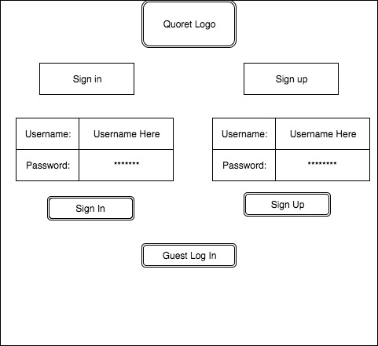
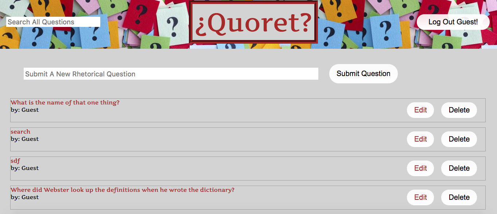
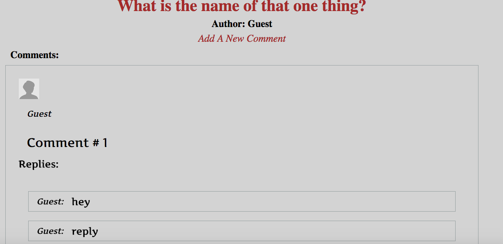
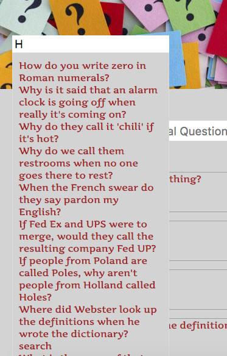

# Quoret
[Quoret](https://quoret.herokuapp.com/#/) is a full stack web application modeled after Quora.com with a twist, it only allows rhetorical questions.

## Structure

The backend of Quoret utilizes Ruby on Rails with a PostgresSQL database, while the frontend was developed using Facebook's React JavaScript library in combination with Redux in order to manage the state of the app.

## Features

### Authentication

Users are able to create accounts and upon logging in, they are given a session token so that the user stays logged in until they decide to log out. Passwords are encrypted using Rails BCrypt gem with utilizes a hashing function in order to build a password digest that is stored on the server rather than the password for added security.

### Questions, Comments, and Replies

Users are able to post Questions which can then be commented on. Furthermore, the comments can then be replied to. Rails ActiveRecord associations are utilized in order to link comments to individual questions and replies to individual comments. These associations are extracted and rendered as JSON through jbuilder.

### Frontend Question Search Capabilities

In order to have predicted search result links that update and render with every keystroke, the search capabilities were generated on the frontend by filtering through all questions using a selector that converts objects in state to an array that can be iterated through.

### In the Future

The current iteration of Quoret was developed within 2 weeks time-period and as a result is still a work in progress. The following features will be implemented in my spare time:

#### Question Tags/Categories

Questions will be able to have tags which act as question categories. A user will be able to sort questions by a certain tag, or simply add a relevant tag to their question. This will be implemented utilizing a join table between tags and questions.

#### Upvote/Downvote

I plan on adding gamification voting such that Users that post questions that are not rhetorical would in theory lose points dependent on user participation.

#### Personal User accounts

Each user will have a profile page which they can add images to and collect internet points. Other users will also be able to see post history.
